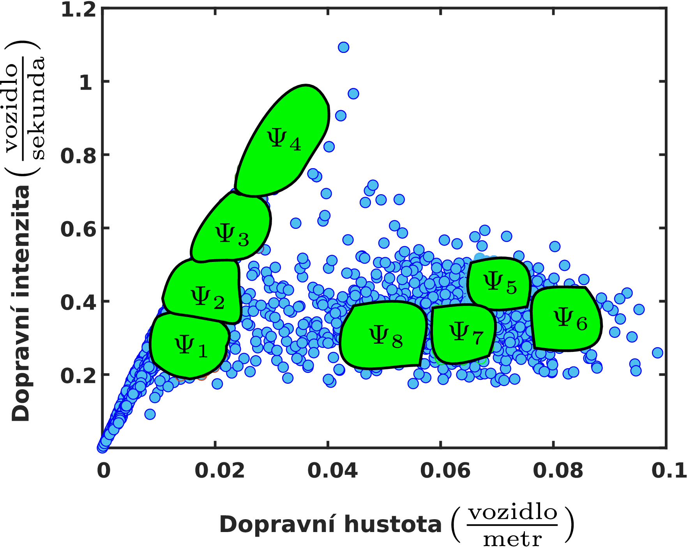

# Vehicular Headway Modelling Research (Bachelor's thesis)

This thesis deals with particle systems with a balancing property which have practical use in
modeling vehicle headways. The __full paper is available here__: [Full paper](thesis.pdf) (2nd place at [scientific conference in 2020](https://mat.fsv.cvut.cz/rektorys/soutez/2020/)).

- First, we summarized basic properties of balanced density functions and as-
sociated particle systems. 
- We presented a unification procedure that is used for analysing traffic data and
by applying this procedure to real data (recorded at a Dutch freeway) __we verified__, using methods of
regression analysis, __the balancing property of time clearances__. 
- Further, we rigorously defined statistical
rigidity and __via the central limit theorem we derived__ the dependency of statistical compressibility on
parametres belonging tu Erlang’s density function. 
- At last, we showed by graphs that the behaviour of
statistical rigidity in well-known balanced particle systems is in accordance with previous derivations.

## Theory of Balanced Particle Systems

    
    

## Fundamental diagram and 3-s Unification procedure for traffic data analysis

    
    

## Real traffic data analysis

    
    

